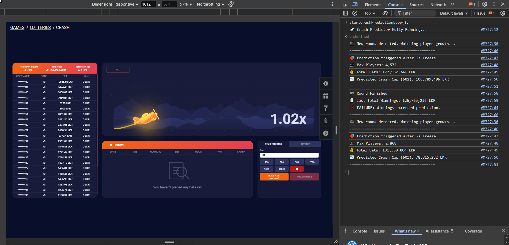

	# 🎯 Crash Predictor (Crash Scanner)

This is a lightweight JavaScript program that monitors the 1xBet Crash Game in real time and predicts potential crash outcomes based on betting behavior.



---

## 🔍 What It Does

- Detects new rounds automatically
- Tracks player count and total bets during growth
- Waits until player count freezes (no growth for 2 seconds)
- Applies a **60% rule** to calculate a predicted crash cap
- Compares it against the **total winnings**
- Logs `✅ SUCCESS` if actual winnings are below the predicted cap, or `❌ FAILURE` if they exceed
- Runs infinitely and automatically across game sessions

---

## 💡 Why the 60% Rule?

Based on observed patterns and common game design in crash-style betting games, platforms like 1xBet often seem to **limit payout liquidity** to ensure profit margins.  
This script assumes that total winnings in a round **typically won’t exceed 60% of total bets**, based on this kind of internal control logic.

You can adjust this threshold in the code to suit your own experiments.

```js
const predictedCrash = Math.floor(totalBets * 0.6); // Change 0.6 to your own ratio
```

---

## 🛠️ How to Run This Program

1. Open the [1xBet Crash Game](https://ind.1xbet.com/games-frame/games/371) in your browser
2. Right-click anywhere on the page → Click **Inspect**
3. Go to the **Console** tab
4. Copy the full contents of `crashPredictor.js` from this repository
5. Paste the code into the console and press **Enter**
6. Then type and run the main function:

```js
startCrashPredictionLoop();
```

You will now see live predictions and round results printed directly in the console.

---

## ⚠️ Disclaimer

This tool is provided **for educational and analytical purposes only**.

We do **not encourage or promote gambling** in any form.  
Gambling can be addictive and harmful. Please act responsibly and in accordance with your local laws.

---

## 📄 License

This project is licensed under the MIT License. Feel free to use, modify, and share it with attribution.

---

## ✨ Contributions

Pull requests and suggestions are welcome.  
If you have ideas to improve logic, visualization, or automation, feel free to contribute!
