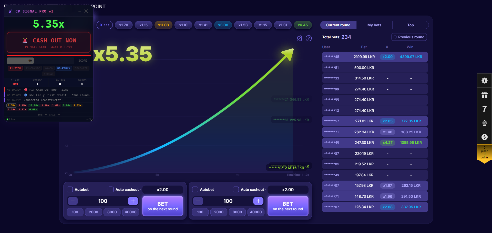
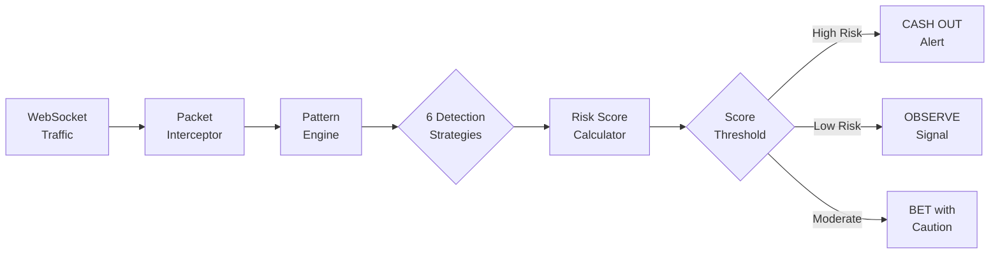
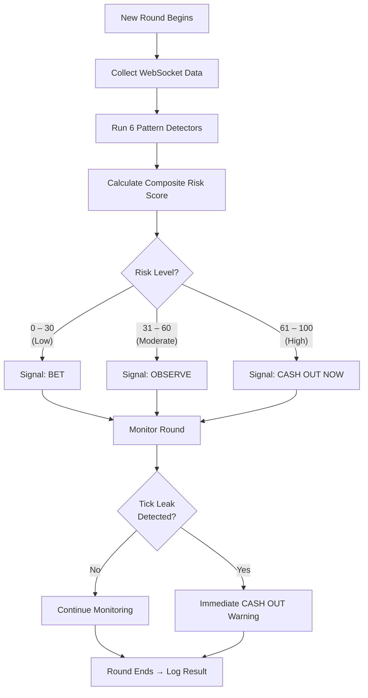
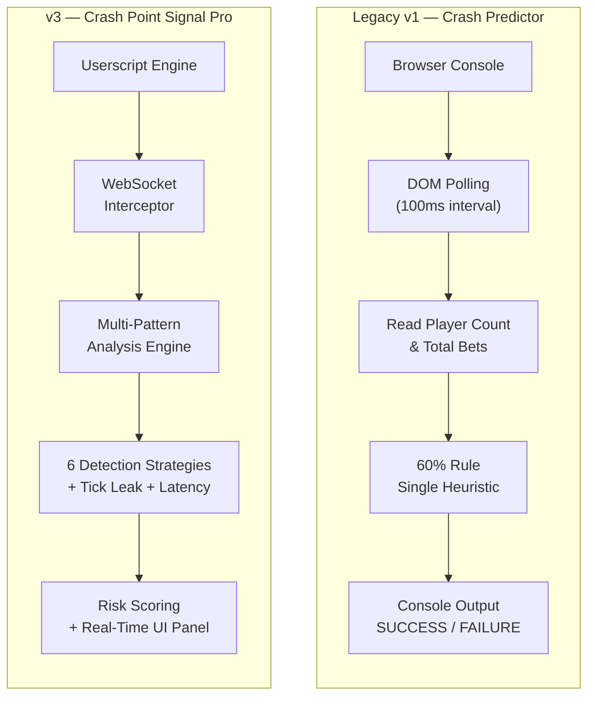
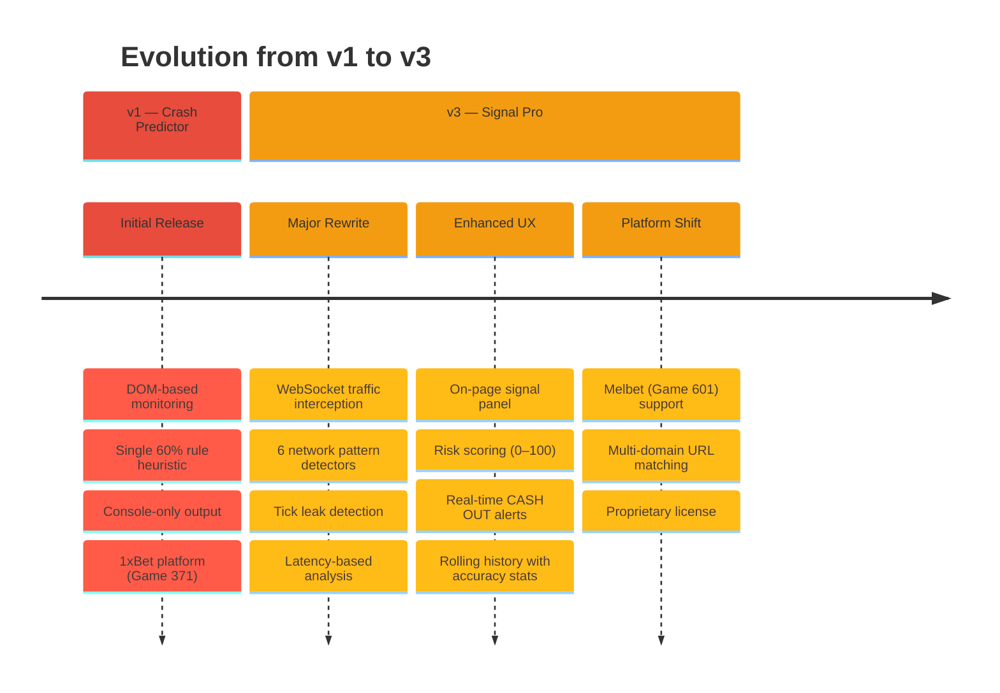

<p align="center">
  
</p>

<h1 align="center">Crash Point Signal Pro v3</h1>

<p align="center">
  <strong>Advanced pattern-based betting signal analyzer for Crash Point (Game 601)</strong><br/>
  WebSocket traffic interception &bull; Tick leak detection &bull; Smart risk scoring &bull; Real-time alerts
</p>

<p align="center">
  <a href="#installation">Installation</a> &bull;
  <a href="#features">Features</a> &bull;
  <a href="#how-it-works">How It Works</a> &bull;
  <a href="#usage-guidelines">Usage</a> &bull;
  <a href="#legacy-version-deprecated">Legacy Info</a> &bull;
  <a href="#license">License</a>
</p>

---

## Overview

**Crash Point Signal Pro** is a sophisticated userscript that intercepts and analyzes WebSocket traffic on Melbet's Crash Point game (Game 601). By monitoring network-level patterns in real time, it provides intelligent betting signals, risk assessments, and cash-out warnings — all rendered in an unobtrusive on-page panel.

> For full technical documentation, pattern breakdowns, and configuration reference, see the **[Full Documentation Repository](https://github.com/dinethlive/crash-point-scanner.git)**.

### Supported Platforms

| URL Pattern | Platform |
|:--|:--|
| `https://melbet-srilanka.com/games-frame/games/601*` | Melbet Sri Lanka |
| `https://*.melbet*.com/games-frame/games/601*` | All Melbet regional domains |

---

## Features

| Feature | Description |
|:--|:--|
| **6 Network Patterns** | Distinct detection strategies for identifying imminent crashes at the network layer |
| **Risk Scoring (0 – 100)** | Pre-round composite risk assessment combining multiple analytical factors |
| **Real-Time Alerts** | Immediate **CASH OUT NOW** warnings when critical patterns trigger mid-round |
| **Tick Leak Detection** | Monitors WebSocket tick irregularities — the most reliable early crash indicator |
| **Latency Analysis** | Tracks server response timing to detect behavioral anomalies |
| **Live Statistics** | Delta time, consecutive profits, win/loss streaks, and round-over-round trends |
| **History Tracking** | Maintains a rolling window of the last 20 crash values with accuracy metrics |
| **On-Page Signal Panel** | Non-intrusive overlay in the top-right corner with real-time data |

---

## How It Works

### Detection Pipeline


```mermaid
flowchart LR
    A["WebSocket\nTraffic"] --> B["Packet\nInterceptor"]
    B --> C["Pattern\nEngine"]
    C --> D{"6 Detection\nStrategies"}
    D --> E["Risk Score\nCalculator"]
    E --> F{"Score\nThreshold"}
    F -->|High Risk| G["CASH OUT\nAlert"]
    F -->|Low Risk| H["OBSERVE\nSignal"]
    F -->|Moderate| I["BET with\nCaution"]
```

### Signal Decision Flow


```mermaid
flowchart TD
    START["New Round Begins"] --> COLLECT["Collect WebSocket Data"]
    COLLECT --> ANALYZE["Run 6 Pattern Detectors"]
    ANALYZE --> SCORE["Calculate Composite Risk Score"]
    SCORE --> CHECK{"Risk Level?"}
    CHECK -->|"0 – 30\n(Low)"| BET["Signal: BET"]
    CHECK -->|"31 – 60\n(Moderate)"| OBSERVE["Signal: OBSERVE"]
    CHECK -->|"61 – 100\n(High)"| ALERT["Signal: CASH OUT NOW"]
    BET --> MONITOR["Monitor Round"]
    OBSERVE --> MONITOR
    ALERT --> MONITOR
    MONITOR --> TICK{"Tick Leak\nDetected?"}
    TICK -->|Yes| CASHOUT["Immediate CASH OUT Warning"]
    TICK -->|No| CONTINUE["Continue Monitoring"]
    CONTINUE --> END["Round Ends → Log Result"]
    CASHOUT --> END
```

### Architecture Comparison: v1 vs v3


```mermaid
graph TB
    subgraph "Legacy v1 — Crash Predictor"
        direction TB
        L1["Browser Console"] --> L2["DOM Polling\n(100ms interval)"]
        L2 --> L3["Read Player Count\n& Total Bets"]
        L3 --> L4["60% Rule\nSingle Heuristic"]
        L4 --> L5["Console Output\nSUCCESS / FAILURE"]
    end

    subgraph "v3 — Crash Point Signal Pro"
        direction TB
        V1["Userscript Engine"] --> V2["WebSocket\nInterceptor"]
        V2 --> V3["Multi-Pattern\nAnalysis Engine"]
        V3 --> V4["6 Detection Strategies\n+ Tick Leak + Latency"]
        V4 --> V5["Risk Scoring\n+ Real-Time UI Panel"]
    end
```

---

## Installation

### Prerequisites

- A modern browser (Chrome, Firefox, Edge)
- A userscript manager extension:
  - [Tampermonkey](https://www.tampermonkey.net/) (recommended)
  - [Violentmonkey](https://violentmonkey.github.io/)
  - [Greasemonkey](https://www.greasespot.net/) (Firefox only)

### Steps

1. Install one of the userscript managers listed above.
2. Get the latest `crash-point-scanner.js` from the **[Full Documentation Repository](https://github.com/dinethlive/crash-point-scanner.git)**.
3. Open the extension and create a **new userscript**.
4. Paste the full contents of `crash-point-scanner.js` into the editor.
5. **Save** the script.
6. Navigate to any [supported Melbet Crash Point URL](#supported-platforms).
7. The signal panel will appear automatically in the **top-right corner** of the page.

---

## Usage Guidelines

| Guideline | Details |
|:--|:--|
| **Wait for Data** | Allow at least **3 rounds** for the system to collect sufficient baseline data before acting on signals |
| **Trust P1 Pattern** | The tick leak indicator (P1) is the most reliable pattern — cash out immediately when triggered |
| **Default Mode** | The system defaults to **OBSERVE**, not BET — signals shift based on real-time analysis |
| **Monitor Streaks** | Watch consecutive profit/loss counters to identify favorable and unfavorable runs |
| **Check Risk Score** | Always review the composite risk score (0–100) before placing any bet |

---

## Legacy Version (Deprecated)

> **The legacy Crash Predictor (v1) is deprecated and no longer maintained.** It remains in this repository solely for historical reference.

### Why Was the Legacy Version Deprecated?

The original **Crash Predictor v1** was a proof-of-concept console script built for 1xBet's Crash Game (Game 371). It has been fully superseded by Crash Point Signal Pro v3 for the following reasons:

| Reason | Legacy v1 | Current v3 |
|:--|:--|:--|
| **Platform** | 1xBet (Game 371) — no longer targeted | Melbet (Game 601) — actively supported |
| **Detection Method** | DOM scraping via `querySelector` — fragile and easily broken by UI changes | WebSocket interception — operates at the network layer, independent of UI |
| **Analysis Strategy** | Single heuristic (60% rule) with no validation | 6 distinct pattern detectors with composite scoring |
| **Data Source** | Visible page elements (player count, bets) | Raw network packets (ticks, latency, server behavior) |
| **Output** | Console-only `console.log` statements | Integrated on-page signal panel with real-time updates |
| **Reliability** | Susceptible to DOM changes, timing drift, and race conditions | Robust network-level analysis immune to UI modifications |
| **Risk Assessment** | None — binary SUCCESS/FAILURE after the fact | Pre-round risk scoring (0–100) with live alerts |
| **User Experience** | Requires manual console operation | Fully automated userscript with visual overlay |
| **Maintenance** | No longer functional or maintained | Actively developed and updated |

### Capability Evolution


```mermaid
%%{init: {'theme': 'base', 'themeVariables': {'cScale0': '#e74c3c', 'cScale1': '#f39c12', 'cScale2': '#2ecc71', 'cScale3': '#3498db', 'cScale4': '#9b59b6', 'cScale5': '#1abc9c'}}}%%
timeline
    title Evolution from v1 to v3
    section v1 — Crash Predictor
        Initial Release : DOM-based monitoring
                        : Single 60% rule heuristic
                        : Console-only output
                        : 1xBet platform (Game 371)
    section v3 — Signal Pro
        Major Rewrite   : WebSocket traffic interception
                        : 6 network pattern detectors
                        : Tick leak detection
                        : Latency-based analysis
        Enhanced UX     : On-page signal panel
                        : Risk scoring (0–100)
                        : Real-time CASH OUT alerts
                        : Rolling history with accuracy stats
        Platform Shift  : Melbet (Game 601) support
                        : Multi-domain URL matching
                        : Proprietary license
```

### Legacy Files

| File | Description |
|:--|:--|
| [`legacy-crashPredictor.js`](legacy-crashPredictor.js) | Original v1 source code (archived) |
| [`legacy-README.md`](legacy-README.md) | Original v1 documentation (archived) |

---

## Project Structure

```
crash-game-scanner/
├── README.md                  # This file — project documentation
├── LICENSE                    # Proprietary license (Crash Point Signal Pro License)
├── legacy-README.md           # Archived v1 documentation
├── legacy-crashPredictor.js   # Archived v1 source code
└── images/
    ├── crash-point-scanner-ss-1.png   # v3 interface screenshot
    └── crash-predictor-demo.png       # Legacy v1 demo screenshot
```

---

## License

This software is proprietary and licensed under the **Crash Point Signal Pro License**.
See the full [LICENSE](LICENSE) file for terms and conditions.

| | |
|:--|:--|
| **Permitted** | Personal use, educational research, learning, experimentation |
| **Prohibited** | Commercial use, redistribution, automated betting, resale, bad faith use |
| **Warranty** | None — provided "AS IS" |

Users must comply with Melbet's Terms of Service and all applicable local laws and regulations.

---

## Disclaimer

> **This tool is for educational and analytical purposes only.**
> Gambling involves substantial financial risk. Past performance does not guarantee future results.
> The authors do not encourage or promote gambling in any form.
> Use this software responsibly, at your own risk and discretion, and in accordance with your local laws.

---

<p align="center">
  <sub>Copyright &copy; 2026 &mdash; All Rights Reserved</sub>
</p>
